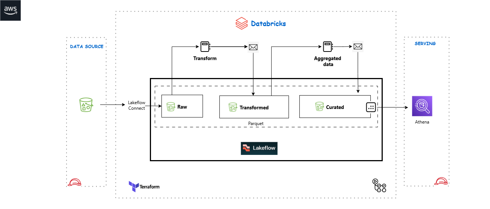

# Databricks Sales Pipeline - Deployment Guide

This guide will walk you through deploying the complete Databricks sales pipeline infrastructure using Terraform.

## Prerequisites

- **Databricks Workspace**: Access to a Databricks workspace
- **AWS Account**: AWS account with appropriate permissions
- **Terraform**: Version >= 1.0
- **AWS CLI**: Installed and configured
- **Git**: For version control

## Architecture Overview


```
AWS S3 Bucket (hema-catalog-data)
├── source/           # Raw CSV files
├── bronze/           # Raw ingested data
├── silver/           # Cleaned/transformed data
└── gold/             # Analytics-ready data
  ├── sales/
  └── customers/

Databricks Workspace (sales_dept)
├── Catalog: sales
│   ├── Schema: 01_bronze
│   ├── Schema: 02_silver
│   └── Schema: 03_gold
└── Job: sales_data_pipeline
  ├── Task 1: load_config
  ├── Task 2: ingest_to_bronze
  ├── Task 3: bronze_to_silver
  └── Task 4: silver_to_gold
```

### 0.1 EasySetup: You can interactively run the command below for interactive setup

```bash
./scripts/setup.sh

```

## Step 1: AWS Setup (Otherewise setup manually)

### 1.1 Configure AWS Credentials

```bash
# Configure AWS CLI
aws configure

# Verify credentials
aws sts get-caller-identity
```

### 1.2 Create S3 Backend Bucket (for Terraform state)

```bash
# Create bucket for Terraform state
aws s3 mb s3://hema-terraform-state --region eu-central-1

# Enable versioning
aws s3api put-bucket-versioning \
  --bucket hema-terraform-state \
  --versioning-configuration Status=Enabled


## Step 2: Databricks Setup

### 2.1 Get Databricks Credentials

1. Log in to your Databricks workspace
2. Go to **Settings** → **Developer** → **Access Tokens**
3. Click **Generate New Token**
4. Copy the token (you won't see it again!)
5. Note your workspace URL (e.g., `https://your-workspace.cloud.databricks.com`)

### 2.2 Get Databricks Account ID

```bash
# Use Databricks CLI or API to get account ID
databricks account get-account

# Or from the Databricks console:
# Settings → Account → Account ID
```

## Step 3: Configure Environment Variables

### 3.1 Set Environment Variables

```bash
# Databricks credentials
export DATABRICKS_HOST="https://your-workspace.cloud.databricks.com"
export DATABRICKS_TOKEN="your-databricks-token"
export TF_VAR_databricks_host=$DATABRICKS_HOST
export TF_VAR_databricks_token=$DATABRICKS_TOKEN

# AWS credentials (if not using AWS CLI profile)
export AWS_ACCESS_KEY_ID="your-access-key"
export AWS_SECRET_ACCESS_KEY="your-secret-key"
export AWS_DEFAULT_REGION="eu-central-1"
```

### 3.2 Create .env File (for local development)

```bash
cat > .env << 'EOF'
# Databricks Configuration
export DATABRICKS_HOST="https://your-workspace.cloud.databricks.com"
export DATABRICKS_TOKEN="your-databricks-token"
export TF_VAR_databricks_host=$DATABRICKS_HOST
export TF_VAR_databricks_token=$DATABRICKS_TOKEN

# AWS Configuration
export AWS_ACCESS_KEY_ID="your-access-key"
export AWS_SECRET_ACCESS_KEY="your-secret-key"
export AWS_DEFAULT_REGION="eu-central-1"
EOF

# Load environment variables
source .env
```

**⚠️ Important**: Add `.env` to `.gitignore` to avoid committing secrets!

## Step 4: Configure Terraform

### 4.1 Update Variables

```bash
cd infra/terraform

# Copy example variables
cp terraform.tfvars.example terraform.tfvars

# Edit terraform.tfvars
vi terraform.tfvars
```

Update the following values in `terraform.tfvars`:
```hcl
aws_region         = "eu-central-1"
s3_bucket_name     = "hema-catalog-data"
workspace_name     = "sales_dept"
catalog_name       = "sales"
notification_email = "your-email@example.com"
```

### 4.2 Update Databricks Account ID

Edit `modules/aws-storage/variables.tf` and update the `databricks_account_id` default value with your actual Databricks account ID.

## Step 5: Deploy Infrastructure

### 5.1 Initialize Terraform

```bash
cd infra/terraform

# Initialize Terraform
terraform init
```

### 5.2 Validate Configuration

```bash
# Validate Terraform configuration
terraform validate

# Check formatting
terraform fmt -recursive
```

### 5.3 Plan Deployment

```bash
# Create execution plan
terraform plan -out=tfplan

# Review the plan carefully
```

### 5.4 Apply Infrastructure

```bash
# Apply the plan
terraform apply tfplan

# Or apply directly (will prompt for confirmation)
terraform apply
```

This will create:
- S3 bucket with folder structure
- IAM roles and policies
- Databricks catalog and schemas
- External locations
- Storage credentials
- Pipeline cluster
- Scheduled job with tasks

## Step 6: Upload Source Data

### 6.1 Upload CSV Data to S3

```bash
# Upload your CSV files to the source folder
aws s3 cp data/train.csv s3://hema-catalog-data/source/

# Or upload all files in data folder
aws s3 sync data/ s3://hema-catalog-data/source/ --exclude "*.md"

# Verify upload
aws s3 ls s3://hema-catalog-data/source/
```

## Step 7: Verify Deployment

### 7.1 Check Databricks Resources

1. Log in to Databricks workspace
2. Navigate to **Data** → **Catalogs**
3. Verify `sales` catalog exists
4. Check schemas: `01_bronze`, `02_silver`, `03_gold`
5. Navigate to **Workflows** → **Jobs**
6. Verify `sales_dept_sales_data_pipeline` job exists

### 7.2 Run the Pipeline

```bash
# Trigger the job manually (first run)
# In Databricks UI: Workflows → Jobs → sales_dept_sales_data_pipeline → Run Now

# Or use Databricks CLI
databricks jobs run-now --job-id <job-id>
```

### 7.3 Monitor Execution

1. Go to **Workflows** → **Jobs** → Your Job
2. Click on the latest run
3. Monitor each task execution
4. Check logs for any errors

## Step 8: Configure GitHub Actions

### 8.1 Set GitHub Secrets

In your GitHub repository, go to **Settings** → **Secrets and variables** → **Actions**, and add:

```
AWS_ACCESS_KEY_ID          = <your-aws-access-key>
AWS_SECRET_ACCESS_KEY      = <your-aws-secret-key>
DATABRICKS_HOST            = <your-databricks-workspace-url>
DATABRICKS_TOKEN           = <your-databricks-token>
TF_STATE_BUCKET            = hema-terraform-state
```

### 8.2 Trigger Workflow

```bash
# Push changes to trigger GitHub Actions
git add .
git commit -m "Deploy Databricks infrastructure"
git push origin main
```

## Troubleshooting

### Issue: Terraform State Lock

```bash
# If state is locked, force unlock
terraform force-unlock <lock-id>
```

### Issue: AWS Permissions

Ensure your AWS IAM user/role has these permissions:
- `s3:*` on the data bucket
- `iam:CreateRole`, `iam:AttachRolePolicy`
- `sts:AssumeRole`

### Issue: Databricks Token Expired

```bash
# Generate new token in Databricks
# Update environment variable
export DATABRICKS_TOKEN="new-token"
export TF_VAR_databricks_token=$DATABRICKS_TOKEN
```

### Issue: External Location Not Accessible

1. Verify IAM role trust relationship
2. Check S3 bucket policies
3. Verify storage credential in Databricks
4. Test connection: **Data** → **External Locations** → Test connection

## Useful Commands

```bash
# Show current state
terraform show

# List all resources
terraform state list

# Get specific output
terraform output job_id

# Destroy all infrastructure (careful!)
terraform destroy

# Refresh state
terraform refresh

# Import existing resource
terraform import <resource_type>.<name> <resource_id>
```

## Maintenance

### Update Pipeline Code

```bash
# After updating Python scripts in src/
cd infra/terraform
terraform apply -target=module.databricks_pipeline
```

### Update Configuration

```bash
# After updating config.yaml
terraform apply -target=module.databricks_pipeline.databricks_dbfs_file.config_file
```

### Schedule Changes

Edit `main.tf` in the root module:
```hcl
job_schedule = {
  quartz_cron_expression = "0 0 7 * * ?"  # Change time here
  timezone_id           = "UTC"
}
```

Then apply:
```bash
terraform apply
```

## Cost Optimization

1. **Cluster Auto-termination**: Set to 20 minutes (default)
2. **Spot Instances**: Enabled with fallback to on-demand
3. **Right-sizing**: Start with `i3.xlarge`, adjust based on usage
4. **Schedule**: Job runs at 7 AM daily; adjust if less frequency needed

## Next Steps

1. Monitor job runs for first few days
2. Set up alerts in Databricks
3. Create dashboards for gold layer data
4. Implement data quality checks
5. Add more transformations as needed

## Support

- **Databricks Documentation**: https://docs.databricks.com
- **Terraform Databricks Provider**: https://registry.terraform.io/providers/databricks/databricks/latest/docs
- **AWS S3 Documentation**: https://docs.aws.amazon.com/s3/

---

**Important Files**:
- `infra/terraform/main.tf` - Root module
- `infra/terraform/variables.tf` - Input variables
- `infra/terraform/terraform.tfvars` - Variable values (gitignored)
- `.github/workflows/terraform-databricks.yml` - CI/CD pipeline